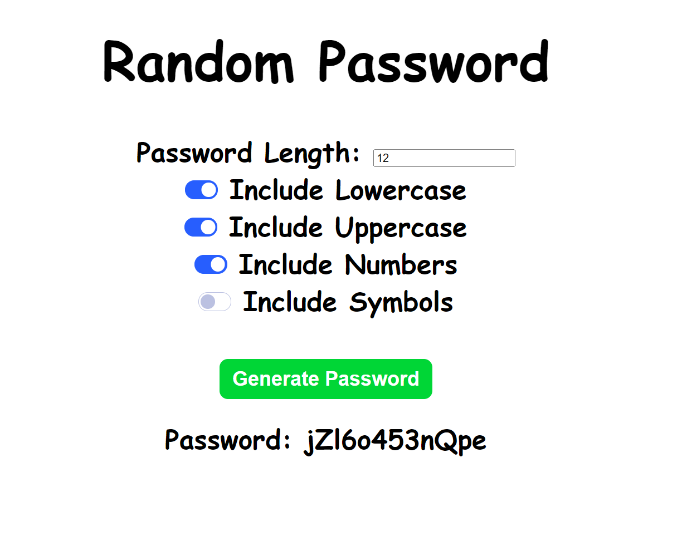

# randomPassword

## Overview

This is a simple web application that generates random passwords based on user preferences. Users can specify the length of the password and choose to include or exclude different character sets such as lowercase letters, uppercase letters, numbers, and symbols. The generated password is displayed in real-time upon clicking the "Generate Password" button.

## Features

- Adjustable password length
- Checkbox options to include/exclude lowercase, uppercase, numbers, and symbols
- Real-time password generation
- User-friendly interface

## App

